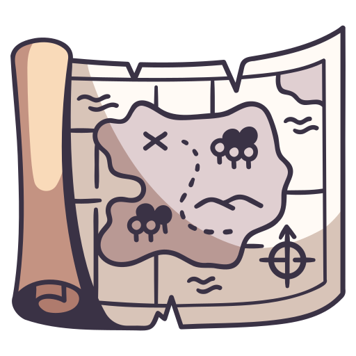

# ⚔️ AI Quest — Study RPG

Live Preview: https://aiquest-studyrpg.netlify.app/

<p align="center">
  
</p>

<p align="center">
  <strong>An 8-bit retro RPG study adventure powered by Generative AI.</strong><br>
  Battle custom-generated monsters, master difficult academic topics, and level up your hero through curriculum-driven combat!
</p>

<p align="center">
  
  
  
  
  
  
  
</p>

---

## 🎮 Key Features

- **🧠 Neural Quest Generator**: Powered by Google Gemini. Enter any subject (from *Quantum Physics* to *World War II History*) and select a difficulty rating (1–10) to dynamically spawn customized multi-stage quests.
- **👾 Turn-Based Battle Engine**:
  - Battle themed pixel monsters (e.g., *"The Fraction Hydra"*, *"Vector Phantom"*).
  - Answering correctly deals lethal damage to the enemy.
  - Incorrect answers damage the player and summon the **Wise Mentor** NPC for an in-depth pedagogical breakdown.
- **🧙‍♂️ Mentor Explanation System**: Instant educational feedback formatted in clean Markdown whenever a question is missed.
- **💾 Persistent Progression (Supabase)**: Saves user levels, XP history, theme preferences, and completed quests.
- **🎨 Retro Aesthetics**:
  - CRT screen scanlines, glowing text, and authentic pixel-art borders.
  - Custom audio sound synthesizer for attacks, clicks, level-ups, and damage SFX.
  - Custom PNG pixel icon support (`/public/assets/`).
- **💻 Secret Hacker Terminal**: Press <kbd>/</kbd> anywhere in the app to launch a retro cheat console!

---

## 🕹️ Secret Shortcuts & Console Commands

### **Global Keyboard Shortcuts**
| Key | Action |
|---|---|
| <kbd>/</kbd> | Open / Toggle the Secret Command Terminal |
| <kbd>Esc</kbd> | Close the Secret Command Terminal |

### **Terminal Console Commands**
Type `/help` or any of the following inside the terminal:
- `god` — Activate **God Mode** (invincibility & auto-correct answers for 60s)
- `matrix` — Trigger a 10-second green Matrix code rain visual effect
- `glitch` — Trigger a retro screen distortion effect
- `xp <number>` — Manually grant experience points to your profile (e.g., `xp 500`)
- `dark` / `light` — Switch system visual theme
- `whoami` — View current player identity & active session info
- `reset yes` — Reset account game progress and restart leveling
- `clear` — Clear terminal output history

---

## 🏗️ Architecture & Tech Stack
┌──────────────────────────────────────────────────────────┐
│ Client (SPA) │
│ React 19 • TypeScript • Tailwind CSS • Motion • Vite │
└──────────────┬────────────────────────────┬──────────────┘
│ │
(Auth & Profile Sync) (Quest Generation POST)
▼ ▼
┌──────────────────────────────┐ ┌───────────────────────────┐
│ Supabase │ │ Netlify Serverless Func │
│ PostgreSQL Auth & Database │ │ /generate-quest.ts │
└──────────────────────────────┘ └─────────────┬─────────────┘
│ (GEMINI_API_KEY)
▼
┌───────────────────────────┐
│ Google Gemini API │
└───────────────────────────┘
code
Code
- **Frontend**: React 19, TypeScript, Vite, Tailwind CSS, Motion, Lucide Icons
- **AI Integration**: Google Gemini via serverless Netlify Functions (zero API key exposure in the browser)
- **Backend & Auth**: Supabase (PostgreSQL, GoTrue Authentication)
- **Deployment**: Netlify / Cloud Run

---

## 📁 Project Structure

```text
├── netlify/
│   └── functions/
│       └── generate-quest.ts    # Secure serverless AI proxy function
├── public/
│   └── assets/                  # Custom 8-bit PNG assets
│       ├── fighter.png          # Player battle icon
│       ├── monster.png          # Enemy battle icon
│       ├── mentor.png           # Mentor NPC avatar
│       ├── quests.png           # Quest tab icon
│       ├── profile.png          # Profile tab icon
│       ├── rankings.png         # Leaderboard icon
│       └── options.png          # Settings tab icon
├── src/
│   ├── components/
│   │   ├── Auth.tsx             # Supabase Login & Registration
│   │   ├── BattleScreen.tsx     # Turn-based combat & question interface
│   │   ├── MatrixRain.tsx       # Canvas-based Matrix rain animation
│   │   ├── QuestSetup.tsx       # Subject & difficulty selector
│   │   └── Terminal.tsx         # In-game cheat/command line interface
│   ├── hooks/
│   │   ├── useGame.ts           # Game state, profile, and inventory hook
│   │   └── useSound.ts          # Web Audio API 8-bit sound synthesizer
│   ├── lib/
│   │   └── supabase.ts          # Supabase client initializer
│   ├── services/
│   │   └── ai.ts                # AI service client bridge
│   ├── App.tsx                  # Root layout & view controller
│   ├── index.css                # Retro CRT shaders, themes & scrollbar rules
│   └── main.tsx                 # React DOM root entry
├── .env.example                 # Environment variables template
├── netlify.toml                 # Netlify build & functions configuration
├── package.json
└── vite.config.ts
⚙️ Environment Variables
Create a .env file in the root directory (or add these in your Netlify / Hosting Dashboard under Environment Variables):
code
Env
# Client-side Supabase Configuration (Settings > API in Supabase)
VITE_SUPABASE_URL=https://your-project-id.supabase.co
VITE_SUPABASE_ANON_KEY=your-supabase-anon-key

# Server-side Gemini API (Google AI Studio - Used only in Netlify Functions)
GEMINI_API_KEY=your_gemini_api_key
Note: GEMINI_API_KEY does not use the VITE_ prefix because it is executed exclusively on the serverless backend, protecting your quota and credentials.
🚀 Getting Started
1. Clone & Install Dependencies
code
Bash
git clone https://github.com/your-username/ai-quest-study-rpg.git
cd ai-quest-study-rpg
npm install
2. Configure Database & Secrets
Create a free project at Supabase.
Grab your Project URL and Anon Key.
Obtain a Gemini API Key from Google AI Studio.
Populate your .env file following .env.example.
3. Run Development Server
code
Bash
npm run dev
Open http://localhost:3000 in your browser.
4. Build for Production
code
Bash
npm run build
🎨 Asset Customization
You can replace any of the game graphics with your own 8-bit sprites without changing any code! Simply place transparent .png files in public/assets/ using these exact names:
fighter.png (Recommended: 64x64 or 128x128)
monster.png (Recommended: 64x64 or 128x128)
mentor.png (Recommended: 64x64 or 128x128)
quests.png, profile.png, rankings.png, options.png (Recommended: 32x32)
